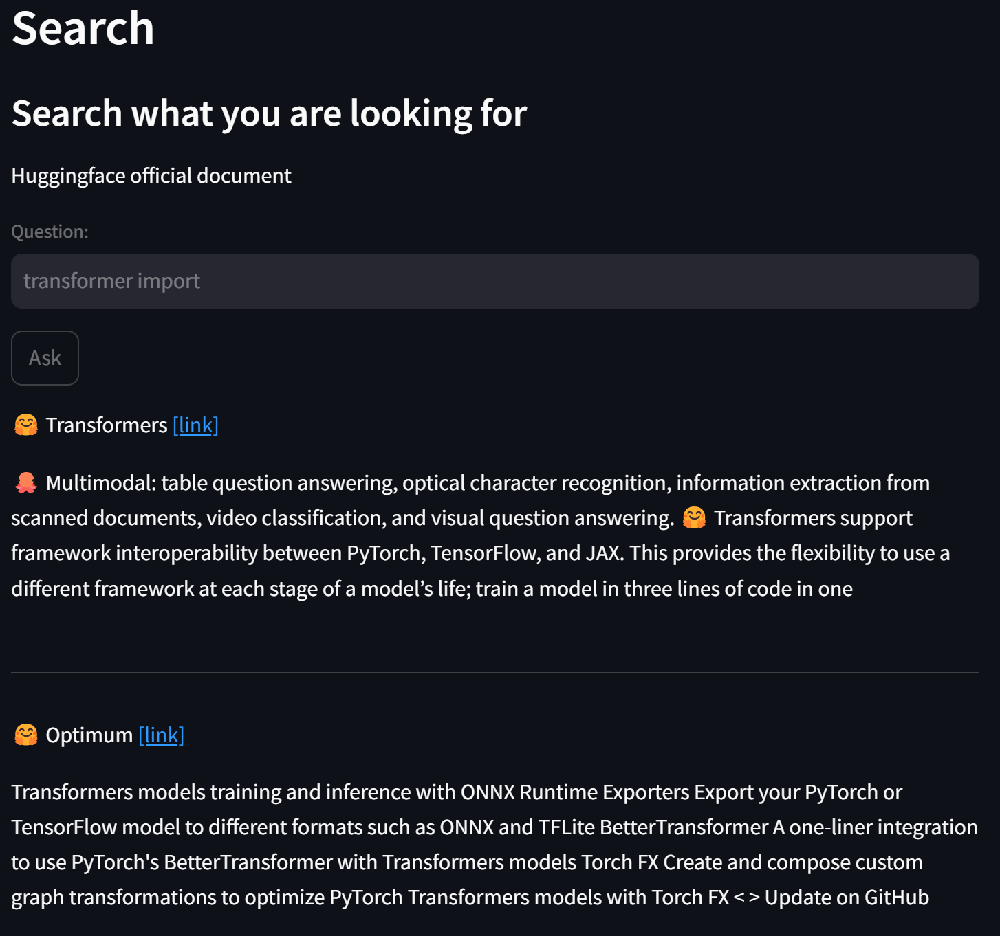

# How to use
1. Intall python packages
```bash
pip install -r requirements.txt
```
> ※ Intalled package list: datasets langchain langchain_community sentence_transformers faiss-cpu beautifulsoup4

2. Run streamlit page and ask query
```bash
streamlit run main.py
```



## How to save and load vectorstore
1. Save Huggingface documents in vectorstore
```bash
python ./save_vectorstore.py
```

2. Load and Ask query to saved vectorstore
```bash
python ./load_vectorstore.py
```